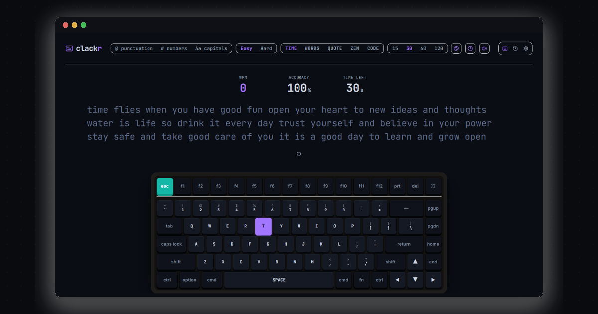

# clackr ⌨️ — Minimal Distraction-Free Typing Speed Test

<div align="center">

  

  <br/><br/>

  [](https://nextjs.org/)
  [](https://react.dev/)
  [](https://www.typescriptlang.org/)
  [](https://tailwindcss.com/)
  [](https://redux-toolkit.js.org/)
  [](LICENSE)

  <br/>

  ### 🌐 [Live App: clackr-plum.vercel.app](https://clackr-plum.vercel.app)

</div>

---

## 🌟 Overview

**clackr** is a state-of-the-art, distraction-free typing speed test application designed for speed typists, developers, and mechanical keyboard enthusiasts. 

Built with **Next.js 15 App Router**, **TypeScript**, **Redux Toolkit**, **Recharts**, and **Tailwind CSS**, it features an interactive 75% mechanical virtual keyboard with live keycap lighting, a low-latency Web Audio API mechanical sound engine, real-time WPM & accuracy analytics, customizable test modes, missed-word practice routines, custom Canvas image scorecard generation, and 6 curated visual themes.

---

## ✨ Key Features

### 1. ⚡ Core Typing Engine
* **5 Versatile Test Modes**:
  * `Time`: Standard timed speed tests (`15s`, `30s`, `60s`, `120s`).
  * `Words`: Target word count challenges (`10`, `25`, `50`, `100` words).
  * `Quotes`: Practice with real-world literary and historical quotes.
  * `Zen`: Free-form practice mode without timer constraints or word limits.
  * `Code`: Code syntax practice featuring real programming snippets.
* **Test Modifiers**: Toggle `@ Punctuation`, `# Numbers`, and `Aa Capitals` into any word pool.
* **Difficulty Modes**:
  * `Easy`: Pre-filtered common English vocabulary.
  * `Hard`: Advanced, complex, and rare vocabulary words.
* **Custom Test Duration**:
  * Configure custom duration tests up to `3600s` (1 hour) via the custom test modal.

### 2. ⌨️ Interactive 75% Mechanical Virtual Keyboard
* **Real-time Key Lighting**: Dynamic visual feedback showing expected target characters and active keypress bottom-outs.
* **3D Tactile Keycaps**: Custom rendered keycaps with mechanical depth, haptic vibration feedback for mobile, and smooth CSS spring transitions.
* **Size Customization**: Switch between `Small`, `Medium`, and `Large` keyboard layout scaling.

### 3. 🔊 Audio Feedback & Sound Synthesizer
* **Web Audio API Engine**: Ultra-low latency click sound synthesis (`<3ms` scheduling buffer) with zero audio lag or stutter.
* **Multiple Sound Profiles**: Choose between `Mechanical` (sampled switch OGG), `Clack` (synth click), `Bubble` (soft pop), or `Error Beep`.
* **Visual Polish**: Spring-animated restart controls and high-performance HTML5 Canvas confetti particle celebration on test completion.

### 4. 📊 Performance Analytics & Practice
* **Interactive Charts**: Recharts-powered WPM and Raw WPM second-by-second performance curves.
* **Personal Best Tracking**: High scores, accuracy, and detailed result history persisted in `localStorage`.
* **Word Review & Practice**: Review mistyped words and launch instant practice tests targeting your weakest vocabulary.
* **Score Card & Exports**: Download high-resolution PNG scorecards generated on HTML5 Canvas or export result stats to JSON and CSV.
* **Social Share Cards**: Dynamic OpenGraph score preview cards for sharing results on X (Twitter), LinkedIn, and Discord.

### 5. 🎨 Multi-Theme System
Includes 6 curated color themes with smooth View Transitions API theme switching:
* 🌑 **Midnight** (Default space blue & electric purple)
* ⚙️ **Carbon** (Graphite & warm cream)
* 💛 **Serika** (Warm sand & gold)
* ❄️ **Nord** (Cool polar slate)
* 🌸 **Sakura** (Cherry pink & mahogany)
* ⚡ **Monokai** (Neon hacker grey & magenta)

---

## ⌨️ Keyboard Shortcuts

| Shortcut | Action |
|---|---|
| `Tab` | Quick restart test / Generate new word pool |
| `Esc` | Toggle Settings Modal (when blurred/idle) |
| `Enter` | Confirm modal dialog action |

---

## 📁 Project Architecture

```
Clackr/
├── public/                 # Static assets, OG cards, favicons & audio files
├── src/
│   ├── app/                # Next.js App Router (Layouts, Pages, Routes, SEO Metadata)
│   │   ├── api/og/         # OpenGraph dynamic route with Edge caching
│   │   ├── share/          # Share landing page with clean OG metadata
│   │   ├── globals.css     # CSS Variables for all 6 themes & keycap animations
│   │   ├── layout.tsx      # Root Layout with JSON-LD SEO Schemas & Webmanifest
│   │   ├── manifest.ts     # Web Application Manifest (PWA)
│   │   ├── robots.ts       # Search Engine Crawling Rules
│   │   └── sitemap.ts      # Dynamic XML Sitemap
│   ├── components/         # Reusable Modular Components
│   │   ├── CustomTestModal # Custom duration & modifier setup modal
│   │   ├── HistoryModal    # High scores & performance history table modal
│   │   ├── Layout          # Application shell & header navigation
│   │   ├── ResultsPanel    # Results dashboard, Recharts WPM graph, Share & Practice modals
│   │   ├── SettingsModal   # Theme switcher, sound controls & live visitor counter
│   │   ├── TestConfig      # Test configuration toolbar
│   │   ├── Toast           # Notification toast provider & confirmation dialog
│   │   ├── TypingArea      # Core typing engine with hardware-accelerated 60fps caret tracking
│   │   ├── VirtualKeyboard # Interactive 75% mechanical virtual keyboard
│   │   └── Word            # Individual word rendering & error highlighting
│   ├── hooks/              # Custom React Hooks (useTypingEngine, useModalFocusTrap)
│   ├── lib/                # Audio synthesizer, stats math, word generators & confetti
│   └── store/              # Redux Toolkit State Management (test, settings, results)
├── next.config.js          # Next.js optimization config
└── tailwind.config.js      # Custom theme token mapping
```

---

## 🛠️ Getting Started

### 1. Clone & Install Dependencies
```bash
git clone https://github.com/adnanashraf-code/Clackr.git
cd Clackr
npm install
```

### 2. Run Development Server
```bash
npm run dev
```
Open [http://localhost:3000](http://localhost:3000) in your browser.

### 3. Build for Production
```bash
npm run build
npm start
```

---

## 👤 Author

<div align="center">
  <br/>
  <a href="https://github.com/adnanashraf-code" target="_blank">
    
  </a>
  <h3><b>Adnan Ashraf</b></h3>
  <p>Full Stack Engineer & Creative Web Developer</p>

  <a href="https://github.com/adnanashraf-code" target="_blank">
    
  </a>

  <br/><br/>
  <p>Crafting high-performance, distraction-free, and visually stunning web experiences. ❤️</p>
  <p>Star this repository if you find it helpful! 🌟</p>
</div>
